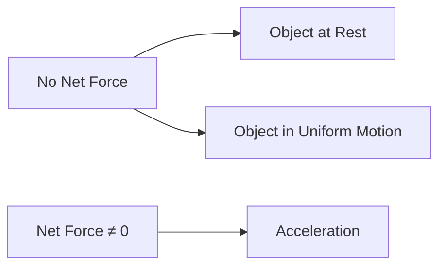

# 🚀 AstraNotes — macOS IB 学习应用 · 软冰晶版

## 架构概览

| 层级 | 技术 | 用途 |
|-------|-----------|---------|
| **UI** | SwiftUI (macOS 14+) | 原生 macOS 界面，软冰晶美学 |
| **音频** | AVFoundation | 讲座录音及波形可视化 |
| **转录** | WhisperKit (CoreML) | 本地 Whisper Large-v3-turbo，支持英/西/中 |
| **AI 处理** | DeepSeek V4 Flash API | 笔记生成、闪卡、测验、图表 |
| **存储** | SwiftData | 本地元数据、设置、闪卡进度 |
| **文件输出** | FileManager → Obsidian 仓库 | 自定义 .md 文件，含 YAML 前置元数据 |
| **富文本渲染** | Mermaid + LaTeX + HTML/CSS | 图表、公式、复杂可视化 |

---

## 设计系统：Soft Cryo（软冰晶）

### 核心理念
**纯净之霜，温暖之心。** 软冰晶美学将冰的纯净本质与亲切柔和融为一体。冰不刺骨，而是抚慰。设计如同踏入重云（Chongyun）的驱邪洞天——洁净、有序、精神纯粹，底层却藏着安静的温度。

### 情感关键词
纯净、宁静、真挚、冰柔、晶莹剔透、亲切、专注、安详、整洁、魔幻

### 设计 DNA

#### 1. 冰感粉彩配色
柔和的蓝、淡青色、霜白、极浅的薰衣草紫。所有颜色都像透过一层冰观看。没有饱和原色，一切都被柔化、 frost 处理。

#### 2. 极致圆角
每个元素都是柔软的。药丸形、圆角卡片、圆形头像、软按钮。圆角传达亲切感和雪堆、冰晶的有机曲线。边框半径在任何地方都 generously 大。

#### 3. 柔和深度与光晕
不使用生硬的投影，而是漫射的粉彩光晕、内高光和模仿光线穿过冰的柔和渐变。深度是氛围的，而非结构的。

#### 4. 晶体装饰系统
冰晶、雪花、霜边、六边形图案、符咒风格的角落装饰。这些不是随机的动漫闪光——它们是几何的、结构化的、有意义的。

#### 5. 仪表盘式布局
受 verels.com 启发：小部件卡片、统计计数器、状态指示器、活动流。布局感觉像个人仪表盘或角色状态界面。

#### 6. 俏皮但真挚的字体
标题可以略带俏皮或风格化，正文保持干净可读。调性是"喜欢动漫的认真开发者"——不是"混乱小鬼"。

### 色彩令牌（含深色模式）

```
=== 浅色模式（霜白）===
background:         #F0F7FF （霜白——极淡的冰蓝）
backgroundWarm:     #F8FBFF （暖霜——用于卡片/ elevated 表面）
foreground:         #2C3E50 （深冰海军蓝——主文本）
foregroundMuted:    #5A6D7E （柔和石板蓝——次级文本）
accent:             #7EC8E3 （柔和天蓝——主强调色）
accentLight:        #B8E3F5 （淡冰蓝——高光、光晕）
accentDark:         #4A9ECF （深青色——悬停状态、强调）
accentGlow:         #D6F0FF （霜光——背景、漫射光）
crystal:            #A8D8EA （晶状青色——装饰元素）
frost:              #E1F5FE （轻霜——微妙背景、标签）
roseIce:            #E8D5E0 （淡薰衣草粉——温暖强调，极少使用）
border:             #C5E3F5 （冰蓝边框——柔和分隔线）
borderStrong:       #7EC8E3 （更强边框——卡片、输入框）
shadow:             rgba(126, 200, 227, 0.15) （柔和蓝影）
shadowGlow:         rgba(126, 200, 227, 0.25) （漫射光晕）

=== 深色模式（极夜冰晶）===
background:         #0F1729 （极夜深蓝——主背景）
backgroundWarm:     #1A2332 （暖夜蓝——用于卡片）
foreground:         #E8F4FC （霜白蓝——主文本）
foregroundMuted:    #8BA3B8 （柔和冰蓝——次级文本）
accent:             #7EC8E3 （柔和天蓝——主强调色，保持不变）
accentLight:        #A8D8EA （晶状青——高光）
accentDark:         #5DB8E0 （亮青色——悬停状态）
accentGlow:         rgba(126, 200, 227, 0.15) （冰蓝光晕）
crystal:            #7EC8E3 （晶体蓝——装饰元素）
frost:              #1E3A4F （深霜蓝——标签背景）
roseIce:            #C4A8B8 （暗薰衣草粉——温暖强调）
border:             #2A4360 （夜蓝边框）
borderStrong:       #4A9ECF （强调边框）
shadow:             rgba(0, 0, 0, 0.3) （深蓝阴影）
shadowGlow:         rgba(126, 200, 227, 0.2) （冰晶光晕）
```

**规则**：所有颜色必须像透过冰过滤过。浅色模式下没有纯黑，深色模式下没有纯黑背景。即使是"深色"文本也是深海军蓝，而非纯黑。

### 字体排版

**字体栈**：
- **展示/标题**：`"Nunito", "Quicksand", sans-serif` —— 柔和、圆润、友好的展示字体，略带俏皮。字重 600–800。
- **正文**：`"Inter", "PingFang SC", "Microsoft YaHei", sans-serif` —— 干净、高可读性、现代无衬线。
- **等宽/标签/统计**：`"JetBrains Mono", "Fira Code", monospace` —— 用于代码片段、统计数字、元数据、标签。
- **装饰性大标题**：`"ZCOOL KuaiLe"` 或类似圆角展示字体（可选，仅用于大型装饰文字）。

**字号比例**（柔和亲切，但层次清晰）：
```
xs:   0.75rem   (12px) —— 细小文字、元数据、徽章
sm:   0.875rem  (14px) —— 说明文字、标签、导航项
base: 1rem     (16px) —— 正文最小值
lg:   1.125rem (18px) —— 正文首选
xl:   1.25rem  (20px) —— 引导段落、卡片标题
2xl:  1.5rem   (24px) —— 章节引言、小部件标题
3xl:  1.875rem (30px) —— 副标题
4xl:  2.25rem  (36px) —— 章节标题
5xl:  3rem     (48px) —— 页面标题、英雄区问候
6xl:  3.75rem  (60px) —— 英雄区名字（桌面端）
```

**字距与行高**：
- 标题：大字用 `tracking-tight` (-0.02em)，小字正常
- 正文：`tracking-normal` (0)，`leading-relaxed` (1.625)
- 标签/等宽：大写标签用 `tracking-wide` (0.05em)
- 展示文字：`leading-tight` (1.1)

### 圆角

```
sm:    8px   —— 小元素、标签、徽章
md:    12px  —— 按钮、输入框、小卡片
lg:    16px  —— 标准卡片、容器
xl:    24px  —— 大卡片、英雄区容器、图片框
2xl:   32px  —— 功能区块、模态框
full:  9999px —— 药丸形、头像、状态指示器、圆形按钮
```

**规则**：圆角不可妥协。尖锐的角会破坏冰晶美学。即使是框内的图片也应有 `lg` 或 `xl` 的半径。

### 边框与分隔线

```
subtle:   1px solid #C5E3F5  （柔和冰边框——最常用）
standard: 1.5px solid #7EC8E3 （强调边框——卡片、输入框）
strong:   2px solid #4A9ECF  （强调——精选卡片、激活状态）
glow:     1px solid #B8E3F5  （用于光晕效果、伪边框）
```

深色模式变体：
```
subtle:   1px solid #2A4360
standard: 1.5px solid #4A9ECF
strong:   2px solid #5DB8E0
```

### 阴影与光晕

```
sm:   0 2px 8px rgba(126, 200, 227, 0.12)  （微妙提升）
md:   0 4px 16px rgba(126, 200, 227, 0.15) （卡片提升）
lg:   0 8px 32px rgba(126, 200, 227, 0.2)  （功能提升）
glow: 0 0 20px rgba(126, 200, 227, 0.25), 0 0 40px rgba(126, 200, 227, 0.1) （晶体光晕）
inner: inset 0 2px 4px rgba(126, 200, 227, 0.08) （内霜高光）
```

深色模式：
```
sm:   0 2px 8px rgba(0, 0, 0, 0.25)
md:   0 4px 16px rgba(0, 0, 0, 0.3)
lg:   0 8px 32px rgba(0, 0, 0, 0.35)
glow: 0 0 20px rgba(126, 200, 227, 0.15), 0 0 40px rgba(126, 200, 227, 0.08)
```

**绝不要使用纯黑阴影。** 所有阴影都带有强调蓝色色调。光晕用于强调，而非阴影。

### 纹理与图案

**主图案：霜噪（全局）**
```css
background-image: url("data:image/svg+xml,%3Csvg viewBox='0 0 256 256' xmlns='http://www.w3.org/2000/svg'%3E%3Cfilter id='noise'%3E%3CfeTurbulence type='fractalNoise' baseFrequency='0.9' numOctaves='3' stitchTiles='stitch'/%3E%3C/filter%3E%3Crect width='100%25' height='100%25' filter='url(%23noise)'/%3E%3C/svg%3E");
opacity: 0.03;
```

**次级图案：冰晶网格（用于卡片/技术区块）**
```css
background-image:
  radial-gradient(circle at 20% 50%, rgba(126, 200, 227, 0.08) 0%, transparent 50%),
  radial-gradient(circle at 80% 80%, rgba(168, 216, 234, 0.06) 0%, transparent 50%);
```

**雪花飘落图案（英雄区背景，微妙）**
```css
background-image: radial-gradient(2px 2px at 20px 30px, rgba(126, 200, 227, 0.3), transparent),
                   radial-gradient(2px 2px at 40px 70px, rgba(184, 227, 245, 0.2), transparent),
                   radial-gradient(1px 1px at 90px 40px, rgba(126, 200, 227, 0.25), transparent);
background-size: 120px 120px, 80px 80px, 100px 100px;
```

**霜边渐变（用于精选卡片）**
```css
border: 2px solid transparent;
background: linear-gradient(#F8FBFF, #F8FBFF) padding-box,
            linear-gradient(135deg, #7EC8E3, #B8E3F5, #A8D8EA) border-box;
```

深色模式变体：
```css
border: 2px solid transparent;
background: linear-gradient(#1A2332, #1A2332) padding-box,
            linear-gradient(135deg, #4A9ECF, #7EC8E3, #A8D8EA) border-box;
```

**六边形冰晶图案（装饰性，纯 CSS）**
使用 CSS `clip-path` 或 SVG 制作小型六边形徽章、统计图标或角落装饰：
```css
clip-path: polygon(50% 0%, 100% 25%, 100% 75%, 50% 100%, 0% 75%, 0% 25%);
```

### 运动哲学：柔和与弹性

动画偏好柔和、俏皮的运动，感觉像冰晶形成或雪花飘落。

**悬停效果**：
- **卡片**：translateY(-4px)，阴影增强，边框发光。时长：200ms ease-out。
- **按钮**：scale(1.03)，渐变变亮，阴影发光。时长：150ms。
- **项目卡片**：图片在圆角框内缩放 1.05，边框发青光。时长：300ms。
- **链接**：下划线从左滑入（渐变下划线），颜色移向 accentDark。时长：200ms。
- **图标按钮**：scale(1.1)，背景变亮。时长：150ms。

**氛围动画**：
- **雪花飘落**：极微妙的 CSS 背景雪花粒子飘落动画（透明度 0.1–0.2，20s 时长，无限循环）。
- **光晕呼吸**：精选卡片有柔和的 box-shadow 脉冲（4s 无限，微妙）。
- **晶体闪光**：悬停时，微妙的闪光渐变扫过卡片边框（CSS 动画，1s）。

```css
/* 卡片悬停提升 */
.card {
  transition: transform 200ms cubic-bezier(0.34, 1.56, 0.64, 1),
              box-shadow 200ms ease-out,
              border-color 150ms ease;
}
.card:hover {
  transform: translateY(-4px);
  box-shadow: 0 8px 32px rgba(126, 200, 227, 0.25);
  border-color: #7EC8E3;
}

/* 按钮弹性悬停 */
.btn-primary {
  transition: transform 150ms cubic-bezier(0.34, 1.56, 0.64, 1),
              box-shadow 150ms ease;
}
.btn-primary:hover {
  transform: scale(1.03);
  box-shadow: 0 0 20px rgba(126, 200, 227, 0.3);
}

/* 精选项目光晕呼吸 */
@keyframes glow-pulse {
  0%, 100% { box-shadow: 0 0 20px rgba(126, 200, 227, 0.2); }
  50% { box-shadow: 0 0 30px rgba(126, 200, 227, 0.35); }
}
.featured {
  animation: glow-pulse 4s ease-in-out infinite;
}
```

**深色模式**：所有光晕效果在深色模式下更加明显，因为对比度更高。

### 无障碍

**对比度**：深冰海军蓝 (#2C3E50) 在霜白 (#F0F7FF) 上提供极佳对比度（约 12:1）。深色模式下霜白蓝 (#E8F4FC) 在极夜蓝 (#0F1729) 上同样优秀。所有文本至少满足 WCAG AA，尽可能达到 AAA。

**焦点状态**（所有交互元素必需）：
```css
/* 按钮焦点 */
focus-visible:outline focus-visible:outline-2 focus-visible:outline-[#7EC8E3] focus-visible:outline-offset-3 focus-visible:shadow-[0_0_0_3px_rgba(126,200,227,0.3)]

/* 输入框焦点 */
focus:border-[#7EC8E3] focus:shadow-[0_0_0_3px_rgba(126,200,227,0.2)] focus:outline-none

/* 卡片焦点 */
focus-visible:border-[#4A9ECF] focus-visible:shadow-[0_0_20px_rgba(126,200,227,0.25)] focus-visible:outline-none
```

**减少动效**：尊重 `prefers-reduced-motion` —— 禁用雪花飘落、光晕呼吸和弹性缩放。仅保留即时过渡。

---

## 第一阶段：项目基础、数据模型与主题系统

**需要创建的文件：**
- `AstraNotes/AstraNotesApp.swift` — 应用入口，SwiftUI + SwiftData，全局主题管理器
- `AstraNotes/Theme/ThemeManager.swift` — 深色/浅色模式切换与动态颜色系统
- `AstraNotes/Theme/CryoColors.swift` — Soft Cryo 配色令牌（支持动态切换）
- `AstraNotes/Models/RecordingSession.swift` — 音频录制元数据
- `AstraNotes/Models/TranscriptionResult.swift` — Whisper 输出模型
- `AstraNotes/Models/GeneratedNote.swift` — AI 生成笔记结构
- `AstraNotes/Models/Subject.swift` — IB 科目配置（HL/SL、组别、教师）
- `AstraNotes/Models/Flashcard.swift` — 闪卡（含间隔重复数据）
- `AstraNotes/Models/QuizQuestion.swift` — 测验题（选择/简答/论述）
- `AstraNotes/Models/IB/TOKNote.swift` — 知识理论笔记
- `AstraNotes/Models/IB/ExtendedEssay.swift` — 拓展论文追踪与反思
- `AstraNotes/Models/IB/InternalAssessment.swift` — 内部评估项目追踪
- `AstraNotes/Models/IB/CASEntry.swift` — CAS 日志条目
- `AstraNotes/Models/AppSettings.swift` — API 密钥、仓库路径、偏好设置、主题模式

**IB 科目组别（6 组 + 核心）：**
- 第 1 组：语言与文学研究
- 第 2 组：语言习得
- 第 3 组：个人与社会
- 第 4 组：科学
- 第 5 组：数学
- 第 6 组：艺术
- 核心：TOK、拓展论文、CAS

**主题系统要求**：
- 全局 `@AppStorage("themeMode")` 存储用户偏好（light/dark/system）
- `CryoColors` 提供动态颜色，根据当前模式返回对应色值
- 所有视图使用 `CryoColors` 而非硬编码颜色
- 系统级深色模式自动检测，支持手动覆盖
- 切换动画平滑过渡（300ms ease）

---

## 第二阶段：音频引擎（AVFoundation）与录音界面

**需要创建的文件：**
- `AstraNotes/Services/AudioService.swift` — 录音引擎
  - AVAudioEngine，16kHz 单声道输出（针对 Whisper 优化）
  - 通过 AVCaptureAudioDataOutput 实时波形可视化
  - 使用 `BGProcessingTask` 后台录音
  - 静音检测自动暂停
  - 文件输出为 .m4a（AAC，节省空间）
  - 录音计时器 + 暂停/继续

- `AstraNotes/Views/Recording/RecordingView.swift` — 录音界面（Soft Cryo 风格）
  - **大型圆形录制按钮**：80×80px，圆形，背景渐变 `linear-gradient(135deg, #7EC8E3, #4A9ECF)`，带柔和光晕阴影
  - **暂停/停止按钮**：40×40px 圆形图标按钮，边框 1px solid #C5E3F5，悬停背景 #E1F5FE
  - **实时波形可视化**：冰蓝色波形 (#7EC8E3)，柔和发光效果，背景带霜噪纹理
  - **计时器显示**：JetBrains Mono 字体，大字号，#2C3E50（浅色）/#E8F4FC（深色）
  - **科目/标签选择器**：药丸形下拉菜单，圆角 full，柔和边框
  - **文件导入支持**：拖拽区域带虚线边框（2px dashed #C5E3F5），圆角 xl，悬停时边框变 #7EC8E3，背景出现淡蓝光晕
  - **深色模式**：波形变为 #A8D8EA，按钮光晕更明显

---

## 第三阶段：Whisper 转录（WhisperKit）与转录界面

**需要创建的文件：**
- `AstraNotes/Services/WhisperService.swift` — 转录引擎
  - 集成 WhisperKit，使用 `large-v3-turbo` CoreML 模型
  - 多语言：英语、西班牙语、中文（自动检测）
  - 长录音进度报告
  - 词级时间戳高亮
  - 60 分钟以上讲座分块处理
  - 模型下载管理（首次启动约 1.5GB 下载）

- `AstraNotes/Views/Transcription/TranscriptionView.swift` — 转录界面（仪表盘风格）
  - **实时转录显示**：文本区域背景 #F8FBFF（浅色）/#1A2332（深色），圆角 lg，内边距舒适
  - **进度指示器**：六边形 clip-path 进度图标，冰蓝色填充，带动画
  - **说话人分段**：不同说话人用淡色标签区分，药丸形徽章
  - **可编辑转录文本**：输入框样式，圆角 md，聚焦时边框 #7EC8E3，带柔和光晕
  - **导出选项**：药丸形按钮组，主按钮渐变，次按钮边框
  - **深色模式**：文本区域背景 #1A2332，文本 #E8F4FC，高亮使用半透明蓝色

---

## 第四阶段：AI 处理引擎（DeepSeek V4 Flash）与提示词系统

**需要创建的文件：**
- `AstraNotes/Services/DeepSeekService.swift` — API 客户端
  - 通过 URLSession 使用兼容 OpenAI 的 HTTP 客户端
  - 长回复流式传输
  - 错误处理 + 重试逻辑
  - Token 用量追踪
  - 高峰/非高峰时段定价感知

- `AstraNotes/Services/PromptEngine.swift` — 中央提示词编排器
  - 上下文组装（转录 + 科目信息 + 历史）
  - Token 预算管理
  - 回复解析 + 验证

### 专业提示词模板

- `AstraNotes/Prompts/NoteGenerationPrompts.swift`
- `AstraNotes/Prompts/FlashcardPrompts.swift`
- `AstraNotes/Prompts/QuizPrompts.swift`
- `AstraNotes/Prompts/StudyGuidePrompts.swift`
- `AstraNotes/Prompts/MermaidDiagramPrompts.swift`
- `AstraNotes/Prompts/IB/TOKPrompts.swift`
- `AstraNotes/Prompts/IB/EEPrompts.swift`
- `AstraNotes/Prompts/IB/IAPrompts.swift`
- `AstraNotes/Prompts/IB/CASPrompts.swift`

**笔记生成系统提示词（示例）：**
```
你是一位专注于国际文凭（IB）课程的资深学术笔记专家。

给定 [科目] [级别] 的讲座转录，生成全面的学习笔记。

要求：
1. 结构：标题 → 学习目标 → 摘要 → 核心概念 → 公式/图表 → 学习问题 → 相关主题
2. 公式：使用 LaTeX，行内用 $...$，块级用 $$...$$
3. 图表：在 ```mermaid 代码块中使用 Mermaid 语法绘制：
   - 概念图（graph TD）
   - 流程图（flowchart LR）
   - 对比图（graph LR 配合 subgraph）
   - 时间线
4. 表格：使用 Markdown 表格进行对比、数据、定义
5. HTML：对于 Mermaid 无法实现的复杂可视化，使用 ```html 代码块及内联 CSS（最大宽度 600px）
6. 考试技巧：包含与 IB 考试相关的技巧，用 💡 标记
7. 难度：HL 专属内容用 [HL] 标签标注

输出格式：有效的 Obsidian 风格 Markdown，含 YAML 前置元数据。
语言：与讲座语言一致。
```

---

## 第五阶段：Obsidian 集成与预览渲染

**需要创建的文件：**
- `AstraNotes/Services/ObsidianService.swift` — 仓库管理器
  - 通过 NSOpenPanel 选择仓库路径
  - 自动检测仓库结构（.obsidian 文件夹）
  - 按科目创建文件夹：`IB/Physics HL/2026-08/`
  - 文件命名：`YYYY-MM-DD_Lecture-Topic.md`
  - YAML 前置元数据生成
  - `[[wikilink]]` 相关笔记解析
  - 标签管理：`#physics #mechanics #HL`
  - 图片/音频资源管理

- `AstraNotes/Utilities/MarkdownRenderer.swift` — 预览渲染器（Soft Cryo 风格）
  - 使用 WebKit（WKWebView）渲染 Mermaid + LaTeX + HTML
  - Obsidian CSS 兼容
  - 自定义 Cryo 主题 CSS：背景 #F0F7FF（浅色）/#0F1729（深色），代码块背景 #E1F5FE（浅色）/#1E3A4F（深色）
  - 打印/导出支持

### Obsidian 笔记模板：
```markdown
---
title: "Lecture: Newton's Laws of Motion"
subject: "IB Physics HL"
group: 4
date: 2026-08-13
tags: [physics, mechanics, newton-laws, HL, forces]
type: lecture-notes
teacher: "Dr. Smith"
duration: "45 min"
status: reviewed
related: "[[Kinematics]] [[Dynamics]] [[Forces]]"
---

# 📝 Newton's Laws of Motion
> **Date:** 2026-08-13 | **Teacher:** Dr. Smith | **Duration:** 45 min

## 🎯 Learning Objectives
- Understand and apply Newton's three laws of motion
- Analyze force diagrams using free-body diagrams

## 📋 Summary
Newton's three laws form the foundation of classical mechanics...

## 🔑 Key Concepts
### Newton's First Law (Inertia)
An object at rest stays at rest unless acted upon by an external force.

$$\sum \vec{F} = 0 \Rightarrow \vec{a} = 0$$



## 📐 Formulas & Equations
| Law | Formula | Description |
|-----|---------|-------------|
| 1st Law | $\sum \vec{F} = 0$ | Law of Inertia |
| 2nd Law | $\vec{F} = m\vec{a}$ | Force = mass × acceleration |
| 3rd Law | $\vec{F}_{AB} = -\vec{F}_{BA}$ | Action-Reaction pairs |

## 💡 IB Exam Tips
- Always draw free-body diagrams for [2 marks] on Paper 2
- Remember: "normal force" is a contact force, not a fundamental force

## 🧠 Study Questions
1. Explain why a passenger lurches forward when a bus stops suddenly. [2 marks]
2. A 5 kg block on a frictionless surface... [4 marks, HL]

## 🔗 Related Topics
- [[Kinematics]]
- [[Dynamics]]
- [[Free-Body Diagrams]]

---
*Generated by AstraNotes · 2026-08-13*
```

---

## 第六阶段：IB 专属功能（晶体仪表盘风格）

### TOK（知识理论）
- 从讲座内容生成知识问题
- 认知方式（WOK）分析模板
- 知识领域（AOK）关联
- 规定题目分析提示词
- TOK 展览规划
- **界面**：六边形图标装饰，柔和渐变卡片，药丸形标签

### 拓展论文（EE）
- 从讲座主题发展研究问题
- 导师会议笔记模板
- 反思模板（RPPF：初稿、中期、终稿）
- 字数追踪（上限 4000 字）
- 分科指导方针（所有 EE 科目）
- **界面**：进度条使用冰蓝色渐变，圆角 full，带柔和光晕

### 内部评估（IA）
- 分科 IA 模板：
  - 科学：探索、分析、评估、结论
  - 数学：引言、探索、推广、验证
  - 语言：书面作业、口试准备
  - 人文：调查、分析、结论
- 个人参与反思提示词
- 字数追踪（因科目而异）
- **界面**：仪表盘式状态卡片，每步一个圆角小部件

### CAS（创意、活动、服务）
- 带证据的活动日志
- 学习成果追踪（7 项成果）
- 反思模板
- 时长/统计仪表板
- **界面**：统计小部件网格（2×2 或 3 列），圆形进度指示器，冰晶图标

---

## 第七阶段：学习工具（软冰晶交互）

### 闪卡系统
- 通过 DeepSeek 从讲座笔记自动生成
- 布鲁姆分类法层级（记忆 → 创造）
- 间隔重复算法（SM-2 变体）
- Anki 兼容导出（通过自定义格式 .apkg）
- 正反面格式，附上下文提示
- **界面设计**：
  - 卡片：大圆角（xl 或 2xl），柔和阴影，霜白背景
  - 翻转动画：3D 翻转，柔和 ease-out，非生硬
  - 按钮：药丸形，"认识/不认识"使用冰蓝渐变和边框变体
  - 进度指示：顶部细条，冰蓝渐变，圆角 full

### 测验生成器
- 选择题（Paper 1 风格）
- 简答题（Paper 2 风格）
- 含评分方案的论述题
- 难度：SL 标准 / HL 拓展
- 计时模式模拟考试
- 分数追踪 + 薄弱领域识别
- **界面设计**：
  - 题目卡片：大圆角，柔和边框，悬停提升
  - 选项按钮：药丸形，选中时冰蓝填充带光晕
  - 计时器：圆形或药丸形，JetBrains Mono，脉冲动画
  - 结果仪表盘：统计小部件网格，六边形图标

### 学习指南生成器
- 多堂讲座主题总结
- 公式表（学科特定）
- 与 IB 教学大纲对齐的考试复习清单
- **界面设计**：可折叠章节，圆角容器，柔和分隔线

---

## 第八阶段：UI 视图（SwiftUI + Soft Cryo）

### 主布局（仪表盘风格）
```
┌──────────────────────────────────────────────────────────────┐
│ ❄️ AstraNotes              🌙 ⚙️ 🔍                         │
├─────────────┬────────────────────────────────────────────────┤
│             │                                                │
│  📚 录音    │      主内容区（圆角卡片容器）                   │
│    ● 录制   │                                                │
│    ○ 导入   │   [录音视图 — 大圆形按钮 + 波形]               │
│             │   [笔记编辑器 — 霜白文本区]                     │
│  📝 笔记    │   [闪卡复习 — 3D 翻转卡片]                     │
│    物理 HL  │   [测验模式 — 药丸选项]                         │
│    数学 SL  │   [IB 工具：TOK/EE/IA/CAS]                    │
│    化学 HL  │                                                │
│    历史 SL  │                                                │
│             │                                                │
│  🃏 学习    │                                                │
│    闪卡     │                                                │
│    测验     │                                                │
│    指南     │                                                │
│             │                                                │
│  📁 IB 核心 │                                                │
│    TOK      │                                                │
│    EE       │                                                │
│    IA       │                                                │
│    CAS      │                                                │
│             │                                                │
├─────────────┴────────────────────────────────────────────────┤
│ 状态：❄️ Whisper 就绪 | 💠 DeepSeek 已连接 | 🌙 深色模式      │
└──────────────────────────────────────────────────────────────┘
```

**布局规范**：
- 侧边栏：宽度 240px，背景 #F8FBFF（浅色）/#1A2332（深色），圆角无（贴合边缘），右侧边框 1px solid #C5E3F5（浅色）/#2A4360（深色）
- 主内容区：背景 #F0F7FF（浅色）/#0F1729（深色），所有内容卡片圆角 lg 或 xl
- 导航栏：顶部固定，高度 52px，背景带毛玻璃效果（blur + 半透明），底部边框 subtle
- 状态栏：底部固定，高度 32px，JetBrains Mono xs，#5A6D7E（浅色）/#8BA3B8（深色）

### 关键视图

- `SidebarView.swift` — 导航栏，带科目树
  - 科目项：圆角 md，悬停背景 #E1F5FE（浅色）/#1E3A4F（深色）
  - 选中状态：左侧 3px 冰蓝指示条，背景微蓝
  - 图标：六边形 clip-path 或圆形徽章

- `DashboardView.swift` — 近期活动概览（仪表盘核心）
  - 统计小部件网格：2–3 列，gap-6
  - 每个小部件：渐变背景（#F8FBFF → #E1F5FE 或 #1A2332 → #1E3A4F），圆角 lg，柔和阴影
  - 数字：JetBrains Mono，2xl，#2C3E50（浅色）/#E8F4FC（深色）
  - 图标：圆形徽章，冰蓝背景，白色图标

- `NoteDetailView.swift` — Markdown 笔记查看/编辑器
  - 编辑器：圆角 xl，霜白背景，内边距舒适
  - 工具栏：药丸形按钮组，图标按钮圆形
  - 预览：WebKit 渲染，应用 Cryo CSS 主题

- `FlashcardReviewView.swift` — 间隔重复闪卡界面
  - 卡片容器：圆角 2xl，阴影 md，最大宽度 600px
  - 正面/背面：3D 翻转动画，柔和 ease-out
  - 按钮组：底部居中，药丸形，"简单/良好/困难"使用不同蓝色深度

- `QuizView.swift` — 带计时和评分的测验
  - 进度条：顶部，冰蓝渐变，圆角 full，高度 6px
  - 题目卡片：圆角 xl，边框 subtle
  - 选项：药丸形按钮，悬停提升，选中发光
  - 计时器：圆形或药丸，脉冲动画

- `TOKPlannerView.swift` — TOK 展览/论文规划器
  - 知识问题卡片：渐变边框（晶体风格），圆角 xl
  - WOK/AOK 标签：药丸形徽章，淡蓝背景

- `EETrackerView.swift` — 拓展论文进度
  - 进度条：冰蓝渐变，圆角 full
  - 反思卡片：圆角 lg，柔和阴影
  - 字数计数器：JetBrains Mono，大字号

- `SettingsView.swift` — API 密钥、仓库、偏好设置、主题切换
  - 主题切换：分段控制器（浅色/深色/跟随系统），药丸形，圆角 full
  - 输入框：圆角 md，边框 standard，聚焦光晕
  - 卡片分组：圆角 lg，背景 #F8FBFF（浅色）/#1A2332（深色）

---

## 组件样式规范（SwiftUI 实现）

### 按钮

**主按钮（冰晶药丸）**：
```swift
.background(
    LinearGradient(
        colors: [Color(hex: "#7EC8E3"), Color(hex: "#4A9ECF")],
        startPoint: .topLeading,
        endPoint: .bottomTrailing
    )
)
.foregroundColor(.white)
.cornerRadius(.infinity) // 药丸形
.padding(.horizontal, 24)
.padding(.vertical, 12)
.font(.system(size: 14, weight: .semibold))
.shadow(color: Color(hex: "#7EC8E3").opacity(0.25), radius: 8, x: 0, y: 4)
// 悬停：渐变变亮，阴影增强，scale(1.02)
```

**次按钮（霜边轮廓）**：
```swift
.background(Color.clear)
.foregroundColor(Color(hex: "#4A9ECF"))
.overlay(
    RoundedRectangle(cornerRadius: .infinity)
        .stroke(Color(hex: "#7EC8E3"), lineWidth: 1.5)
)
// 悬停：背景填充 #E1F5FE（浅色）/#1E3A4F（深色），文字变深
```

**幽灵按钮（软链接）**：
```swift
.background(Color.clear)
.foregroundColor(Color(hex: "#5A6D7E"))
// 悬停：文字移向 #4A9ECF，下划线出现
```

**图标按钮（圆形）**：
```swift
.frame(width: 40, height: 40)
.background(Color(hex: "#F8FBFF")) // 深色: #1A2332
.cornerRadius(.infinity)
.overlay(
    Circle().stroke(Color(hex: "#C5E3F5"), lineWidth: 1) // 深色: #2A4360
)
// 悬停：背景 #E1F5FE，阴影 sm，scale(1.05)
```

### 卡片/容器（小部件风格）

**标准卡片（霜面板）**：
```swift
.background(Color(hex: "#F8FBFF")) // 深色: #1A2332
.cornerRadius(16)
.overlay(
    RoundedRectangle(cornerRadius: 16)
        .stroke(Color(hex: "#C5E3F5"), lineWidth: 1) // 深色: #2A4360
)
.padding(24)
.shadow(color: Color(hex: "#7EC8E3").opacity(0.12), radius: 8, x: 0, y: 2)
// 悬停：阴影增强为 md，边框移向 #7EC8E3，offsetY(-2)
```

**精选卡片（晶体）**：
```swift
.background(Color(hex: "#FFFFFF")) // 深色: #1A2332
.cornerRadius(24)
.overlay(
    RoundedRectangle(cornerRadius: 24)
        .stroke(
            LinearGradient(
                colors: [Color(hex: "#7EC8E3"), Color(hex: "#B8E3F5"), Color(hex: "#A8D8EA")],
                startPoint: .topLeading,
                endPoint: .bottomTrailing
            ),
            lineWidth: 2
        )
)
.padding(32)
.shadow(color: Color(hex: "#7EC8E3").opacity(0.2), radius: 20, x: 0, y: 0)
// 悬停：光晕增强，scale(1.01)
```

**状态卡片（仪表盘小部件）**：
```swift
.background(
    LinearGradient(
        colors: [Color(hex: "#F8FBFF"), Color(hex: "#E1F5FE")],
        startPoint: .topLeading,
        endPoint: .bottomTrailing
    )
) // 深色: [#1A2332, #1E3A4F]
.cornerRadius(16)
.padding(16)
// 内部布局：HStack，图标 + 数字 + 标签
// 图标：圆形徽章，冰蓝背景，白色图标
```

### 标签 / 徽章

**语言标签**：
```swift
.background(Color(hex: "#E1F5FE")) // 深色: #1E3A4F
.foregroundColor(Color(hex: "#4A9ECF"))
.font(.system(.caption, design: .monospaced))
.textCase(.uppercase)
.padding(.horizontal, 12)
.padding(.vertical, 4)
.cornerRadius(.infinity)
.overlay(
    Capsule().stroke(Color(hex: "#C5E3F5"), lineWidth: 1) // 深色: #2A4360
)
```

**状态徽章**：
```swift
.background(Color(hex: "#E1F5FE")) // 深色: #1E3A4F
.foregroundColor(Color(hex: "#4A9ECF"))
.cornerRadius(.infinity)
// 圆点指示器：8px 圆形，#7EC8E3，微妙脉冲光晕动画
```

### 输入框

**文本输入（霜字段）**：
```swift
.background(Color(hex: "#FFFFFF")) // 深色: #0F1729
.cornerRadius(12)
.overlay(
    RoundedRectangle(cornerRadius: 12)
        .stroke(Color(hex: "#C5E3F5"), lineWidth: 1.5) // 深色: #2A4360
)
.padding(.horizontal, 16)
.padding(.vertical, 12)
// 占位符：#5A6D7E，斜体
// 聚焦：边框 #7EC8E3，光晕阴影
```

---

## 纹理与图案实现

**全局霜噪覆盖**：
```swift
// 在 ContentView 或 Window 层级添加
.overlay(
    Image("frost-noise") // 或 SVG 数据
        .resizable()
        .opacity(0.03)
        .allowsHitTesting(false)
)
```

**冰晶网格背景（用于技术区块）**：
```swift
.background(
    RadialGradient(
        colors: [Color(hex: "#7EC8E3").opacity(0.08), .clear],
        center: .init(x: 0.2, y: 0.5),
        startRadius: 0,
        endRadius: 200
    )
)
.background(
    RadialGradient(
        colors: [Color(hex: "#A8D8EA").opacity(0.06), .clear],
        center: .init(x: 0.8, y: 0.8),
        startRadius: 0,
        endRadius: 200
    )
)
```

**雪花飘落（英雄区背景，可选）**：
```swift
// 使用 ParticleEmitter 或 Canvas 绘制微妙雪花
// 透明度 0.1–0.2，20s 时长，无限循环
```

---

## 深色模式切换机制

```swift
// ThemeManager.swift
enum ThemeMode: String, CaseIterable {
    case light = "light"
    case dark = "dark"
    case system = "system"
}

@Observable
class ThemeManager {
    @AppStorage("themeMode") var mode: ThemeMode = .system
    
    var colorScheme: ColorScheme? {
        switch mode {
        case .light: return .light
        case .dark: return .dark
        case .system: return nil
        }
    }
    
    var isDark: Bool {
        // 根据系统或手动设置返回
        if mode == .dark { return true }
        if mode == .light { return false }
        // system: 检测系统外观
        return NSApp.effectiveAppearance.bestMatch(from: [.darkAqua, .aqua]) == .darkAqua
    }
}

// CryoColors.swift
struct CryoColors {
    static func background(_ manager: ThemeManager) -> Color {
        manager.isDark ? Color(hex: "#0F1729") : Color(hex: "#F0F7FF")
    }
    
    static func backgroundWarm(_ manager: ThemeManager) -> Color {
        manager.isDark ? Color(hex: "#1A2332") : Color(hex: "#F8FBFF")
    }
    
    static func foreground(_ manager: ThemeManager) -> Color {
        manager.isDark ? Color(hex: "#E8F4FC") : Color(hex: "#2C3E50")
    }
    
    static func foregroundMuted(_ manager: ThemeManager) -> Color {
        manager.isDark ? Color(hex: "#8BA3B8") : Color(hex: "#5A6D7E")
    }
    
    static func accent(_ manager: ThemeManager) -> Color {
        Color(hex: "#7EC8E3") // 保持不变
    }
    
    static func accentDark(_ manager: ThemeManager) -> Color {
        manager.isDark ? Color(hex: "#5DB8E0") : Color(hex: "#4A9ECF")
    }
    
    static func border(_ manager: ThemeManager) -> Color {
        manager.isDark ? Color(hex: "#2A4360") : Color(hex: "#C5E3F5")
    }
    
    static func frost(_ manager: ThemeManager) -> Color {
        manager.isDark ? Color(hex: "#1E3A4F") : Color(hex: "#E1F5FE")
    }
}
```

**切换动画**：
```swift
// 在根视图上应用
.preferredColorScheme(themeManager.colorScheme)
.animation(.easeInOut(duration: 0.3), value: themeManager.isDark)
```

---

## 完整文件结构

```
AstraNotes/
├── AstraNotes/
│   ├── App/
│   │   ├── AstraNotesApp.swift
│   │   └── ContentView.swift
│   ├── Theme/
│   │   ├── ThemeManager.swift
│   │   └── CryoColors.swift
│   ├── Models/
│   │   ├── RecordingSession.swift
│   │   ├── TranscriptionResult.swift
│   │   ├── GeneratedNote.swift
│   │   ├── Subject.swift
│   │   ├── Flashcard.swift
│   │   ├── QuizQuestion.swift
│   │   ├── AppSettings.swift
│   │   └── IB/
│   │       ├── TOKNote.swift
│   │       ├── ExtendedEssay.swift
│   │       ├── InternalAssessment.swift
│   │       └── CASEntry.swift
│   ├── Services/
│   │   ├── AudioService.swift
│   │   ├── WhisperService.swift
│   │   ├── DeepSeekService.swift
│   │   ├── ObsidianService.swift
│   │   └── PromptEngine.swift
│   ├── Views/
│   │   ├── Components/          ← 新增：可复用 Cryo 组件
│   │   │   ├── CryoButton.swift
│   │   │   ├── CryoCard.swift
│   │   │   ├── CryoTag.swift
│   │   │   ├── CryoInput.swift
│   │   │   ├── CryoIcon.swift
│   │   │   └── HexagonBadge.swift
│   │   ├── Sidebar/
│   │   │   └── SidebarView.swift
│   │   ├── Recording/
│   │   │   └── RecordingView.swift
│   │   ├── Transcription/
│   │   │   └── TranscriptionView.swift
│   │   ├── Notes/
│   │   │   └── NoteDetailView.swift
│   │   ├── Study/
│   │   │   ├── FlashcardReviewView.swift
│   │   │   ├── QuizView.swift
│   │   │   └── StudyGuideView.swift
│   │   ├── IB/
│   │   │   ├── TOKPlannerView.swift
│   │   │   ├── EETrackerView.swift
│   │   │   ├── IAWorkbenchView.swift
│   │   │   └── CASJournalView.swift
│   │   ├── Dashboard/
│   │   │   └── DashboardView.swift
│   │   └── Settings/
│   │       └── SettingsView.swift
│   ├── Prompts/
│   │   ├── NoteGenerationPrompts.swift
│   │   ├── FlashcardPrompts.swift
│   │   ├── QuizPrompts.swift
│   │   ├── StudyGuidePrompts.swift
│   │   ├── MermaidDiagramPrompts.swift
│   │   └── IB/
│   │       ├── TOKPrompts.swift
│   │       ├── EEPrompts.swift
│   │       ├── IAPrompts.swift
│   │       └── CASPrompts.swift
│   ├── Utilities/
│   │   ├── MarkdownRenderer.swift
│   │   ├── MermaidGenerator.swift
│   │   ├── LaTeXFormatter.swift
│   │   └── Extensions.swift
│   └── Resources/
│       ├── Assets.xcassets/
│       └── FrostNoise.svg       ← 新增：霜噪纹理
├── AstraNotesTests/
└── Package.swift (SPM dependencies)
```

---

## 依赖项（Swift Package Manager）

| 包 | 用途 |
|---------|---------|
| `WhisperKit` (argmaxinc/whisperkit) | 通过 CoreML 本地运行 Whisper |
| `SwiftData` (内置) | 本地持久化 |
| 无外部 Markdown 库 | 自定义 Markdown + WebKit 渲染 |

---

## 实现顺序

1. **第一阶段** → 数据模型 + 应用骨架 + 主题系统（基础）
2. **第二阶段** → 音频录制 + 波形界面（采集音频）
3. **第三阶段** → Whisper 转录 + 进度界面（语音转文字）
4. **第四阶段** → DeepSeek API + 提示词引擎 + 笔记生成（AI 核心）
5. **第五阶段** → Obsidian 仓库集成（文件输出）
6. **第六阶段** → IB 模板（TOK/EE/IA/CAS 视图）
7. **第七阶段** → 学习工具（闪卡 + 测验）
8. **第八阶段** → 仪表盘 + Cryo 组件库 + 深色模式 + 打磨测试

> **注意：** 我们在 Windows 上编写代码，但项目目标平台是 macOS。用户将在 MacBook 上创建 Xcode 项目，添加 Swift 文件，并通过 SPM 安装 WhisperKit。所有代码将在 macOS 14+ 及 Xcode 16+ 上编译。

---

## 预估规模

- **约 45 个 Swift 文件**（新增 10 个 Cryo 组件），涵盖模型、服务、视图、提示词、工具类、主题系统
- **约 9 个专业提示词模板**，用于 DeepSeek
- **完整 IB 覆盖**：6 个科目组 + TOK + EE + IA + CAS
- **3 项学习工具**：闪卡、测验、学习指南
- **Obsidian 集成**：自定义 .md 文件，含 YAML 前置元数据、Mermaid、LaTeX、HTML
- **Soft Cryo 设计系统**：完整配色令牌、组件库、纹理系统、深色模式
- **仪表盘式布局**：小部件卡片、统计计数器、状态指示器、活动流

---

## 成功标准

最终应用必须给人感觉像：
- 重云（Chongyun）的个人学习仪表盘
- 一个舒适的冰法师数字工作空间
- 柔软、亲切的动漫风格学习工具，拥有真正的个性
- 走进《原神》中一个霜主题的界面

绝不能像：
- 带蓝色按钮的通用 Bootstrap 模板
- 企业 SaaS 落地页
- 深色模式"黑客"工具
- 没有层次的混乱闪亮动漫粉丝站
- 带蓝色点缀的极简现代风格

设计在可爱亲切与学术可信度之间取得平衡——冰是柔软的，但知识是真实的。❄️